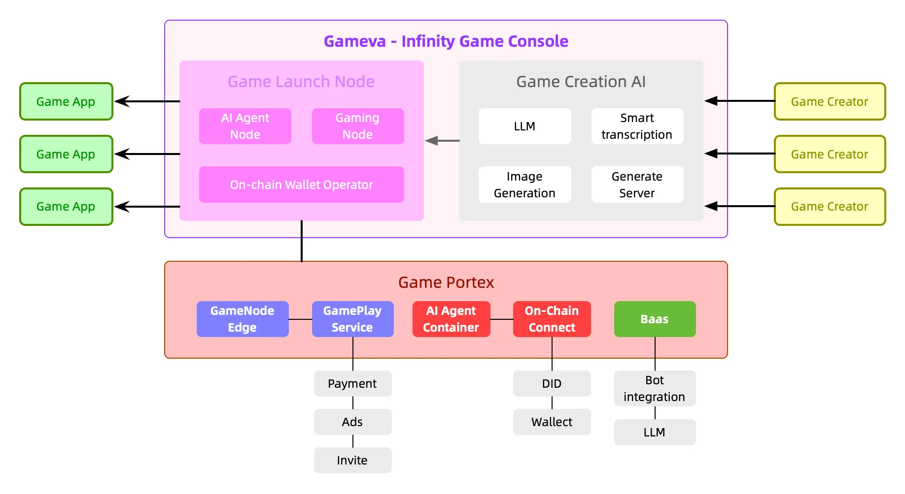

# Guide

1. Select a Prototype

Begin by selecting a game template from our library of mini-games.&#x20;

<figure><figcaption></figcaption></figure>

<figure><figcaption></figcaption></figure>

2. Customise and launch your game by chatting with Eva, our AI game creation agent

You can customise details such as:&#x20;

* **Name:** The official name of the game you are creating
* **Description:** A short intro about your game. This would be displayed publicly on the Gameva.Ai game library and should highlight the core gameplay, features, and unique elements
* **Character Details**: This includes the visual design of your in-game character and the personality —whether it’s friendly, mysterious, robotic, or adventurous.
* **Background Details**: The background serves as the **map and visual foundation** of your game. You can define details such as:&#x20;
  * **Design Style:** Sci-fi, fantasy, cyberpunk, minimalistic, pixel art, etc.
  * **Symbols & Icons:** Key visual elements that shape the game world, such as futuristic circuits, ancient ruins, or celestial patterns.
  * **Game Map Elements:** Terrain types, structures, landmarks, and dynamic features

<figure><figcaption></figcaption></figure>

3. Create you game's Ai agent&#x20;

Upload an avatar image for your AI agent and define its personality with a short description. Your AI agent will serve as a key element in your game, including  but not limited to:

* **In-Game Guide:** Offering real-time hints, tutorials, and strategic insights to help players navigate challenges.
* **Dynamic NPC:** Interacting with players, reacting to their decisions, and driving immersive storytelling.
* **Adaptive Opponent:** Challenging players with evolving strategies, learning from their gameplay, and adjusting difficulty dynamically.
* **Quest Giver:** Assigning missions, rewarding players, and providing lore to enrich the game world.
* **Game Master:** Introducing surprises, special events, or unexpected twists to keep gameplay fresh and exciting.

<figure><figcaption></figcaption></figure>

4. Token Launch

Connect your wallet, upload and fill in your coin details & launch. Your token will be launched via pump.fun.&#x20;

<figure><figcaption></figcaption></figure>

\
